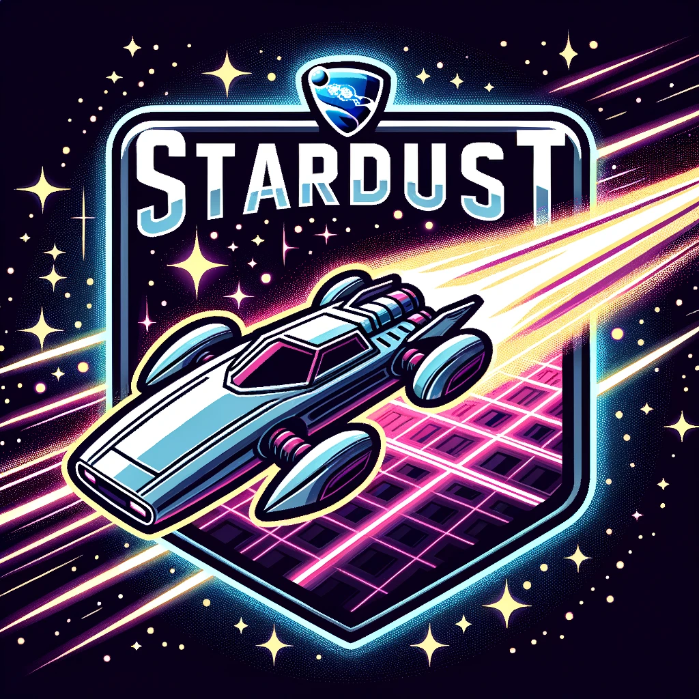

# :rocket: RLBot Repository :rocket:

Welcome to the repository dedicated to [**RLBot**](http://www.rlbot.org/), a framework designed for operating offline bots in Rocket League. Get started with **Stardust** by following these steps after downloading **RLBotGUI**:

---

### :cd: Installation

1. **Clone or download** this repository to your local machine.
2. Launch **RLBotGUI**.
3. Click on **"Add"** located at the top-left corner.
4. Choose **"Load Folder"** and navigate to the repository folder.

---

# :star2: Stardust: A Decent Rocket League Bot :star2:

Embarked initially as a Python learning venture through the SkillQuest course, the project has transitioned into an ongoing endeavor to compete in the **RLBot Championship** and various other tournaments. The roadmap includes a comprehensive overhaul to refine the strategy, logic, mechanics, mathematics, and other elements, aiming to optimize **Stardust** into a formidable hardcoded bot utilizing **GoslingUtils**.

---

### :hammer_and_wrench: Current Development Stage: Planning & Preliminary Implementation

The planning phase is actively underway, with a portion of the implementation already commenced. A notable effort has been directed towards transitioning the control system from **PD (Proportional, Derivative)** to a more nuanced **PID (Proportional, Integral, Derivative)** approach to enhance car control. However, the preliminary tests have yet to yield the desired results. The journey towards optimization continues, laying the groundwork for a robust and competitive Rocket League bot.

